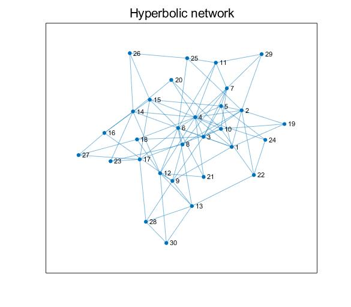

# 데이터가 사는 그래프: 그래프 이론의 소개   

Author: Hyekyoung Lee (Seoul National University Hospital)  
Date: 20 August 2019  

# Analysis plan 

- Step 1: [Generating artificial complex networks](#generating-artificial-complex-networks)
- Step 2: [Visualizing artificial complex networks](#visualizing-artificial-complex-networks) 
- Step 3: [Calculating complex network measures such as efficiency, centrality, degrees, and modularity](#calculating-complex-network-measures)  
  - [Global network measures](#global-network-measures-global-and-average-local-efficiencies)
  - [Local network measures](#local-network-measures-degree-local-efficiency-and-betweenness)
    

# Generating artificial complex networks

Download: You can download cnm toolbox for the generation of artificial complex networks 
made by Gregorio Alanis-Lobato [here](https://se.mathworks.com/matlabcentral/fileexchange/45734-cnm)  
  
Here we generate five artificial complex networks:  
- Regular network (RE)  
- Small world network (SW)  
- Random network (RA)  
- Scale free network (SF) 
- Hyperbolc network (HY)  
  
    
    
```Matlab
% demo_generation.m 
clear all 

% cnm toolbox should be in current folder
addpath('.\cnm');  
% the name of networks we generate 
network_name = {'Regular network','Small world network','Random network', ... 
    'Scale free network','Hyperbolic network'};

% number of nodes in a network 
p = 30;
% ratio of the number of connected edges to the number of all possible edges 
sparsity = 0.2; 
% number of all possible edges 
q = p*(p-1)/2; 
% number of neareast neigbors to which each node is connected 
k = round(q*sparsity*2/p); 
% power law scaling exponent of the network's node degree distribution
gamma = 4; 
% network temperature that allows for clustering tuning
T = 0.1; 

%%% Step 1: Generating artificial complex networks 
% Regular network 
RE = regular_net('N',p,'k',k); 
% Small world network 
SW = sw_net('N',p,'k',k); 
% Random network 
RA = er_net('N',p,'P',sparsity);
% Scale free network 
SF = ba_net('N',p,'m',round(k/2));
% Hyperbolic geometric network
HY = h2_net('N',p,'ave_deg',k,'gamma',gamma,'T',T,'plot','no'); 
```

# Visualizing artificial complex networks

## Visualizing SF using MATLAB built-in functions  
(You can find an example provided by MathWorks [here](https://www.mathworks.com/help/matlab/ref/matlab.graphics.chart.primitive.graphplot.layout.html).) 

```Matlab
% demo_graphplot.m

% demo_generation.m continued 
demo_generation 

% Step 2: Visualizing SF
[row,col] = find(SF); % find the index of nodes of connected edges (row,col) in SF  
tind = find(row < col); % because SF is a symmetric matrix 
row = row(tind); col = col(tind); 
G = graph(row,col); 

figure; 
h = plot(G,'Layout','force'); 
layout(h,'force','UseGravity',true,'Iterations',1000); 
title(network_name{5}); 
set(gca,'FontSize',14); 
```



You can plot other networks in the same way.  


## Visualizing RE, SW, and RA by varying sparsity  

```Matlab
% demo_varyingsparsity.m 
clear all 

% cnm toolbox should be in current folder
addpath('.\cnm');  
% the name of networks we generate 
network_name = {'Regular network','Small world network','Random network'}; 

% number of nodes in a network 
p = 30;
% number of all possible edges 
q = p*(p-1)/2; 

% Plot RE, SW, and RA by varying sparsity 
figure; 
for s = 1:10, 
    % ratio of the number of connected edges to the number of all possible edges 
    sparsity = s*0.1; 
    % number of neareast neigbors to which each node is connected 
    k = round(q*sparsity*2/p); 

    % Step 1: Generating networks 
    % Regular network 
    RE = regular_net('N',p,'k',k); 
    % Small world network 
    SW = sw_net('N',p,'k',k); 
    % Random network 
    RA = er_net('N',p,'P',sparsity);

    % Step 2: Visualizing networks
    for i = 1:3, 
        if i == 1,
            net = RE; 
        elseif i == 2,
            net = SW; 
        else
            net = RA; 
        end 
        
        [row,col] = find(net); % find the index of nodes of connected edges (row,col) in SF  
        tind = find(row < col); % because SF is a symmetric matrix 
        row = row(tind); col = col(tind); 
        G = graph(row,col);
        subplot(3,10,(i-1)*10+s); 
        h = plot(G,'Layout','force'); 
        layout(h,'force','UseGravity',true,'Iterations',1000); 
        
        if s == 5, 
            title(network_name{i});
        end 
        if i == 3, 
            xlabel(['sparsity=' num2str(sparsity)]); 
        end 
        set(gca,'FontSize',14); 
    end
end
```


You can try to plot SFs and HYs by varying sparsity. 


# Calculating complex network measures

You can download codes for complex network measures [here](https://sites.google.com/site/bctnet/Home/functions). 

## Global network measures: global and average local efficiencies

```Matlab
% demo_efficiency.m
clear all;

network_name = {'RE','SW','RA','SF','HY'};

% Estimate global and local efficiencies
Eglob = []; Eloc = [];
for iter = 1:100,
    for s = 1:10,
        sparsity = s*0.1;
        [RE,SW,RA,SF,HY] = graph_generation(sparsity);
        
        for j = 1:5,
            if j == 1,
                A = RE;
            elseif j == 2,
                A = SW;
            elseif j == 3,
                A = RA;
            elseif j == 4,
                A = SF;
            else
                A = HY;
            end
            
            Eglob(s,j,iter) = efficiency_bin(A);
            Eloc(s,j,iter) = mean(efficiency_bin(A,1)); 
        end
    end
    display(num2str(iter)); 
end

% plot the average global and local efficiencies of 100 random complex networks 
figure;
subplot(1,2,1), plot([1:10]*0.1,mean(Eglob,3),'.-','MarkerSize',10);
xlabel('Sparsity'); ylabel('Global efficiency'); 
legend(network_name); set(gca,'FontSize',14);
subplot(1,2,2), plot([1:10]*0.1,mean(Eloc,3),'.-','MarkerSize',10);
xlabel('Sparsity'); ylabel('Local efficiency'); 
legend(network_name); set(gca,'FontSize',14);
``` 


## Local network measures: degree, local efficiency, and betweenness


  
